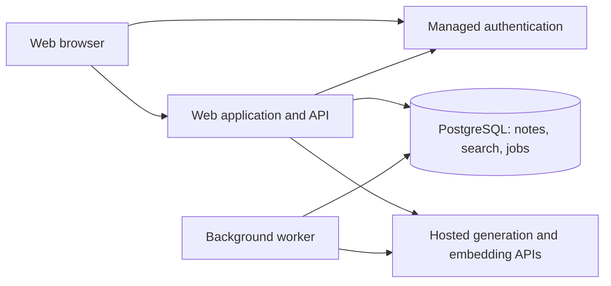

# Notes with an AI assistant — specification and architecture

Status: proposed implementation baseline. Date: 2026-09-28.

This document captures the agreed direction and supplies recommended implementation defaults. It does not represent a deployed system or verified performance. No application code is included.

## 1. Product purpose

Build an approachable personal notebook for the general public. People can save notes about anything, find them later, and ask an assistant to summarize or answer questions using their saved material.

The core success journey is: write a note → return later → find it using words or a description → receive an answer with useful source references.

### Decisions established during planning

- Responsive web app; each account has a private notebook.
- Simple editor with basic formatting and checklists.
- Hosted AI with clear disclosure and limited context sharing.
- Assistant can summarize, search, and answer; it cannot modify notes.
- Reliable saving is independent of AI availability.
- Start with a single application and a background worker.

### Out of scope for the first version

Shared notebooks, public publishing, attachments, audio, OCR, web browsing, external integrations, AI editing, autonomous agents, block-based page building, offline synchronization, and native mobile apps. Persistent conversation history and subscription billing are also deferred. Usage limits still apply.

## 2. Product specification

### Accounts and privacy

Use managed authentication with email sign-in and recovery. An unauthenticated visitor sees a short explanation and sign-in page. Do not offer an anonymous notebook that requires a later migration in the first version.

Notes are private by default. Before the first AI operation, explain that relevant note text and questions are sent to an external AI service. Notebook-wide AI processing requires explicit activation; ordinary note-taking works without it. New notes are eligible after activation unless excluded individually. Turning AI off prevents further processing and schedules removal of stored embeddings.

Exclusion means the note is unavailable to all AI operations, including summaries and semantic search. Excluded notes remain available to ordinary keyword search. Re-enabling AI requires indexing again.

### Notes

- Create a note with an optional title; show “Untitled” when empty.
- Support paragraphs, headings, bold, italic, links, bulleted and numbered lists, and checklists.
- Autosave after approximately 750 ms of idle typing and attempt a save when leaving the editor. Show “Saving,” “Saved,” or an actionable failure state.
- A save is successful only after the server commits it. Serialize saves per editor and use revision checks to prevent silent overwrites from another tab or device.
- On a revision conflict, preserve the current unsaved text and offer a recovered copy or reload. Do not silently merge rich text.
- On connection loss, retain the open draft in memory, show an offline warning, and allow copying it. Reload-safe offline drafts are not promised in this version.
- Pin notes and assign multiple tags. Default ordering: pinned first, then most recently edited.
- Move notes to trash, restore them, or permanently delete them with confirmation. Proposed automatic trash retention: 30 days.
- Proposed initial limit: 100,000 plain-text characters per note and 5,000 active notes per account. Display limits before rejecting input; tune after load testing.

### Search

Provide a single search entry point with ordinary keyword results and an explicit “Search by meaning” option. Search titles and bodies; support tag filters. Results show a title, snippet, and edited date. Clicking opens the note.

Keyword search uses current saved content. Meaning-based search uses eligible indexed notes and labels when recent edits are still being indexed. Never show obsolete passages as current results. Semantic search returns note results without requiring a generated answer.

### Assistant

Two clearly labeled scopes: **This note** and **My notes**. Opening the assistant from a note defaults to that note. A notebook-level entry point defaults to My notes. Changing scope resets the transient conversation to prevent hidden carryover.

Supported actions:

1. Summarize the selected note, including key points and explicit action items when present. Do not invent tasks.
2. Find relevant notes from a natural-language description.
3. Answer questions using relevant saved passages, with clickable references.

Answers must distinguish missing evidence from an empty notebook. If sources disagree, describe the disagreement and cite both. Phrase personal claims as “Your notes say…” where appropriate; saved material is evidence of what was written, not independent verification of reality.

The assistant has no web access and must not imply that it searched outside the notebook. Broad requests such as “list every project I have ever mentioned” must disclose when retrieval covers only a subset rather than imply exhaustive coverage.

Follow-up questions are supported within the open session. Prior messages may help interpret a question, but source passages are retrieved and authorized afresh for every turn. Chat is held in browser memory and cleared on sign-out; there is no saved chat history in v1.

### Export and deletion

Export active and trashed notes as Markdown plus a JSON manifest preserving tags, dates, pin state, trash state, and AI eligibility. Generate an authenticated download; avoid permanent public URLs. Explain that exported files contain private content.

Account deletion requires reauthentication and explicit confirmation. Immediately disable account access and further AI work, revoke sessions, and enqueue deletion of notes, indexes, jobs, and authentication identity. Proposed primary-data purge target: within 24 hours. Backup expiry target: at most 30 days, subject to verified hosting capabilities. Explain provider retention separately; do not promise recall of data already sent to a provider.

## 3. Screens and interaction

| Screen | Main elements |
| --- | --- |
| Sign-in | Product explanation, email sign-in, recovery |
| Notebook | New note, search, tag filters, pinned/recent list, editor |
| Assistant panel | Scope, suggested prompts, question input, response, sources, cancel |
| Trash | Deleted notes, restore, permanent delete |
| Settings | AI activation, privacy explanation, usage, export, account deletion |

Desktop uses a note list and editor with an optional assistant panel. Mobile presents these as separate navigable views, preserving the selected note and unsaved editor state.

Include empty, loading, error, offline, indexing, and usage-limit states. Keyboard navigation, visible focus, labeled controls, sufficient contrast, and screen-reader announcements for save and assistant status are required. Target WCAG 2.2 AA, verified during implementation.

## 4. Proposed technical architecture

Recommended default: a TypeScript web application using React and a server framework, managed PostgreSQL with pgvector, managed authentication, and a worker process from the same repository. Choose and pin the specific framework, editor library, hosts, and AI models during implementation after checking compatibility, privacy terms, and cost. These vendor choices are not prerequisites for the architecture below.

PostgreSQL is the source of truth for notes and job state. Its full-text search supports matching and ranking text; pgvector adds similarity search without introducing a separate vector database. See the [PostgreSQL text-search documentation](https://www.postgresql.org/docs/15/textsearch-intro.html) and [pgvector documentation](https://github.com/pgvector/pgvector).

The browser never receives provider credentials or database administrative credentials. The API verifies the session and derives the user identity; client-supplied owner IDs are never authoritative. The worker handles indexing and cleanup, not interactive saves.

Use a small provider adapter for embedding and generation operations, with configurable models, timeouts, usage accounting, and structured responses. Avoid a general agent framework for v1.

## 5. Data model

All user-owned records carry `user_id`; timestamps are UTC. Use UUID identifiers and foreign keys. Composite ownership constraints prevent linking records across accounts.

| Entity | Key fields and purpose |
| --- | --- |
| profiles | Auth user ID, AI activation timestamp, AI enabled flag, account state, privacy epoch, created timestamp |
| notes | ID, user ID, title, structured editor JSON, derived plain text, revision, pinned, AI excluded, created/updated/deleted timestamps |
| tags | ID, user ID, name and normalized name; unique normalized name per user |
| note_tags | User ID, note ID, tag ID; unique association with ownership constraints |
| note_chunks | ID, user ID, note ID, note revision, chunk ordinal, heading/offset metadata, text, embedding, embedding model/version |
| index_state | Note ID, desired revision, indexed revision, model version, pending/ready/failed status, safe error code |
| jobs | ID, user ID, type, note ID/revision where relevant, deduplication key, state, attempt count, availability, lease expiry |
| usage | User ID, time bucket, request count, reserved/actual tokens, model identifier; no note text |
| deletion_tasks | Account or note reference, progress and deadlines for purge and backup deletion replay; minimum retained metadata |

The original note is authoritative. Plain text, full-text vectors, chunks, and embeddings are derived. Notes increment their revision on content changes. Eligibility changes also invalidate in-flight AI requests through the account privacy epoch.

Create indexes for note ownership and list ordering, normalized tags, full-text search, current chunks by owner/note/revision, and pending jobs. Begin with exact vector search over eligible user data. Introduce approximate indexes only after measuring performance and retrieval recall; filtering can reduce returned matches with approximate indexes, as described in the [pgvector filtering guidance](https://github.com/pgvector/pgvector#filtering).

## 6. Request and background flows

### Saving and indexing

1. The client sends structured content and its expected revision.
2. The server validates ownership, document schema, size, and revision.
3. In one transaction, save the note, derive plain text/full-text fields, increment its revision, and enqueue a deduplicated indexing job if AI eligible.
4. Return the committed revision and timestamp. Saving is now complete, regardless of indexing state.
5. A worker leases the job, checks current eligibility and revision, splits text by paragraphs/headings, and requests embeddings. Starting chunk sizes: approximately 500 tokens with modest overlap; tune using retrieval evaluation.
6. Before publishing chunks, recheck account state, eligibility, and revision. Atomically replace the indexed generation only if still current; otherwise discard obsolete work.

Use at-least-once jobs with idempotent writes, bounded exponential retries, lease recovery, and a failed-job state. A periodic reconciliation finds eligible notes whose current revision lacks an index. Do not embed every keystroke: coalesce jobs across rapid saves.

Any retrieval joins chunks to the live note and requires matching revisions, active account, no trash state, and AI eligibility. Old chunks may remain temporarily for cleanup but are never eligible evidence. Show an indexing notice and use current keyword matches as a fallback where useful.

### Summarizing one note

Read the current authorized note directly, so a summary does not wait for embeddings. Capture its revision. Short notes fit in one request; long notes use bounded section summaries with source mapping and a final synthesis. Never silently truncate. If limits prevent a full summary, explain the limitation. Reject or label the result as stale if the note changes before completion.

### Answering across notes

1. Authenticate, check AI activation, validate scope, and reserve usage allowance atomically.
2. Search current eligible content by keywords and by similarity to the embedded question. Apply ownership and eligibility within both retrieval queries.
3. Combine ranked candidates, remove duplicates, and select passages within a fixed context budget. Initial defaults: up to 20 candidates per search method and 8 final passages, tuned through evaluation.
4. Send labeled passages, source IDs, the question, and bounded conversational context to generation. Instruct the model to use supplied evidence, acknowledge gaps, and treat all note text as untrusted data.
5. Require structured answer segments with source IDs. Validate that each cited ID belongs to the supplied evidence. Invalid references trigger one bounded retry or a safe failure; never fabricate a link.
6. Recheck source eligibility, note revisions, and the account privacy epoch before showing the answer. Discard an answer whose sources changed or became unavailable.
7. Return the answer and authorized source metadata. Opening a reference rechecks access and highlights the passage where possible.

For v1, display a progress state and buffer generated text until these checks pass. This avoids exposing partial answers before authorization and citation validation. Citation validity does not establish factual support; semantic support is evaluated separately.

### Privacy changes and races

Trash, permanent deletion, account deletion, and AI exclusion immediately affect live retrieval filters and increment the privacy epoch. Cancel pending jobs where possible; workers recheck before provider calls and before writing results. Clear displayed assistant answers when the client receives an eligibility-change event and revalidate on focus/navigation. Already delivered text or an already dispatched provider request cannot be retracted; the privacy explanation must be honest about this boundary.

## 7. API boundaries

These are logical contracts; route naming may change with the selected framework.

| Operation | Contract |
| --- | --- |
| List/read notes | Authenticated, cursor-paginated, own notes only; trash separate |
| Create note | Validated body; idempotency key prevents duplicate creation on retries |
| Update note | Expected revision required; conflict returns 409 without overwriting |
| Trash/restore/delete | Authorized state transition; repeated requests safe |
| Manage tags | Ownership checked for both note and tag |
| Search | Query, keyword/meaning mode, optional tags; bounded results |
| Ask/summarize | Scope, optional note ID, bounded question/history, request ID |
| Cancel AI request | Best-effort cancellation; provider work already performed may incur usage |
| Export | Authenticated export/download; streamed or background job for large accounts |
| Change AI settings | Activation/exclusion changes with immediate eligibility enforcement |
| Delete account | Recent reauthentication, confirmation, async deletion status |

Return stable error codes for validation, conflict, rate limits, indexing delay, provider timeout, and unavailable sources. Do not expose private resource existence to other users. Enforce request/body limits and safe rendering of notes and AI output.

## 8. Security and data handling

- Verify authorization on every read, write, search, export, job, and source lookup.
- Use database row-level security as defense in depth and test with the actual application role. PostgreSQL documents that table owners and privileged roles can bypass policies; do not assume merely enabling RLS secures administrative connections. See [row-security documentation](https://www.postgresql.org/docs/18/ddl-rowsecurity.html).
- Use TLS, encrypted managed storage/backups, secure session cookies, CSRF protection where applicable, restrictive content security policy, and server-side secret storage.
- Sanitize editor output and model-rendered Markdown; disallow executable HTML and unsafe link schemes.
- Treat retrieved notes as untrusted content. Give the model no tools for editing, network access, or secret retrieval. Prompt instructions supplement access controls; they do not replace them.
- Do not log note bodies, questions, generated answers, embeddings, or raw provider payloads. Log request IDs, timings, counts, model identifiers, and sanitized error codes.
- Require provider terms compatible with private notes, including verified training-use policy, retention, regional handling, and deletion behavior. Do not promise zero retention until verified.
- This architecture uses server-readable content and hosted AI; it does not provide end-to-end encryption. Describe that accurately in product copy.
- Apply deletions after backup restoration before reopening service. Purge tracking must survive restoration without preserving deleted note text.

## 9. Reliability, cost, and operating targets

Proposed beta targets, to be validated under representative load:

| Measure | Target |
| --- | --- |
| Committed save latency | p95 below 1 second, excluding client debounce |
| Keyword search latency | p95 below 500 ms for an account at the proposed note limit |
| Index freshness | 95% of ordinary note edits indexed within 60 seconds |
| Ordinary AI answer | p95 below 15 seconds; timeout with retry option by 30 seconds |
| Availability | Initial monthly target 99.5% for notebook operations |
| Backup recovery | Proposed RPO 24 hours and RTO 8 hours; verify with a restore exercise |

Treat long-note summaries separately from ordinary answer latency. Monitor saves, conflicts, search latency, index backlog, failed jobs, provider errors, AI latency, and per-account cost without recording content.

Start with configurable daily AI allowance, two concurrent AI requests per user, bounded context/output tokens, and a global spending cap. Reserve allowance before requests and reconcile actual usage afterward, including failures that consumed provider tokens. Queue embedding work with separate limits. Tune numeric quotas and select a sustainable free/paid policy before public launch.

On AI outage, preserve editing and keyword search. On indexing outage, keep notes saved and explain that meaning-based search is updating. On database failure, never report a successful save. Retry transient failures with bounded backoff; avoid retry storms and duplicate billing.

## 10. Validation and acceptance criteria

### Functional release checks

- A note survives reload after the Saved indicator appears.
- Concurrent edits produce a visible conflict and retain the unsaved text.
- Formatting, checklists, tags, pins, trash, restore, and export round-trip correctly.
- Keyword search includes eligible ordinary and AI-excluded notes; AI operations exclude the latter.
- A cited answer opens the correct source note and passage.
- Empty notebooks, insufficient evidence, conflicting notes, and indexing delays have distinct useful responses.
- Mobile and keyboard-only users can complete the core journey.

### Security and failure checks

- Two-account integration tests cover guessed IDs, search, source links, tags, exports, jobs, and account deletion.
- A stale indexing job cannot publish over a newer edit or resurrect deleted/excluded content.
- Exclusion or deletion during an AI request prevents delivery of a newly invalid answer.
- Prompt-injection notes cannot cause cross-account retrieval or tool actions.
- Provider outage, worker restart, exhausted quota, and database failure preserve the documented save and error behavior.
- Restore a backup in isolation and apply deletion records before declaring recovery successful.

### Answer-quality evaluation

Maintain synthetic notebooks and questions covering exact facts, paraphrases, multiple sources, contradictions, no-answer cases, long notes, and malicious instructions. Do not use private production notes without separate consent.

Initial release gates: zero cross-account or excluded-note disclosures in the test suite, all displayed citation IDs valid, at least 90% retrieval hit rate for answerable fixture questions, and at least 90% supported factual claims in manually reviewed answers. Include at least 50 representative questions and record model, prompt, and embedding versions. These are proposed acceptance thresholds, not measured results or guarantees. Expand evaluation based on observed failures.

## 11. Implementation milestones

1. **Notebook foundation:** authentication, schema, editor, autosave/revision conflicts, tags/pins, keyword search, trash, export. Exit: reliable save and account-isolation checks pass.
2. **Single-note assistant:** AI activation/exclusion, provider adapter, summary flow, quotas, safe rendering and source references. Exit: summaries are grounded and AI failure does not affect notes.
3. **Notebook assistant:** worker, versioned embeddings, hybrid retrieval, question answering, citations and race handling. Exit: retrieval and answer-quality gates pass.
4. **Public beta readiness:** accessibility review, account purge, backup restore, monitoring, load tests, privacy disclosure and provider review. Exit: operational targets measured and launch limits configured.

## 12. Decisions remaining before implementation or launch

These do not change the agreed product scope and can use implementation recommendations without reopening the whole plan:

- Select the web framework, editor, managed auth/database host, deployment region, and pinned versions before coding their integrations.
- Select generation and embedding providers/models after evaluating quality, privacy terms, latency, and cost; changing embedding models requires a versioned reindex.
- Confirm retention and recovery targets against the chosen hosts before publishing promises.
- Set production AI quotas, budget, and business model before public launch.
- Start with English interface text and Unicode notes; evaluate multilingual retrieval before advertising language-specific quality.
- Product name and visual identity remain open; neither blocks architecture work.

The implementation should preserve the boundaries described here even if individual vendors change: notes remain authoritative, saves remain independent of AI, and every generated answer depends on freshly authorized source material.
